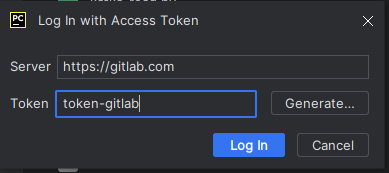

# Работа с PyCharm
## Базовые команды
### Клонирование имеющегося репозитория

### Показать текущий статус

### Клонирование репозитория с передачей логопасса
TBD
### Обновить состояние репозитория

### Показать список доступных веток

### Создать ветку от текущей и переключиться на неё

После создания PyCharm сам переключиться на созданную ветку

### Отслеживать новый файл
В момент создания файла PyCharm сам предлагает добавить файл

В случае отказа от отслеживания он появится в разделе "Commit", который также можно будет сохранить

### Сохранить изменения в ветке
Необходимо выбрать те файлы, которые необходимо сохранить, ниже описать текст изменения, коммита, затем нажать на кнопку Commit

Ветка, в которой есть закоммиченные изменения появится зеленая стрелочка

### Запушить изменения в удаленный репо
Необходимо выбрать те файлы, которые необходимо сохранить, ниже описать текст изменения, коммита, затем нажать на кнопку Commit and Push

Появится окно со сводной информацией. Затем нажать кнопку Push

Если уже имеются закоммиченные изменения запушить изменения можно через меню

### Переключиться на имеющуюся ветку

В PyCharm переключиться на указанную ветку

