# Работа с git в Visual Studio Code
## Базовые команды
### Клонирование имеющегося репозитория
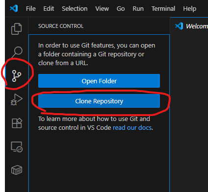

Ввести ссылку на репо и нажать Enter
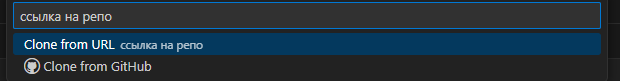

Выбрать место для сохранения
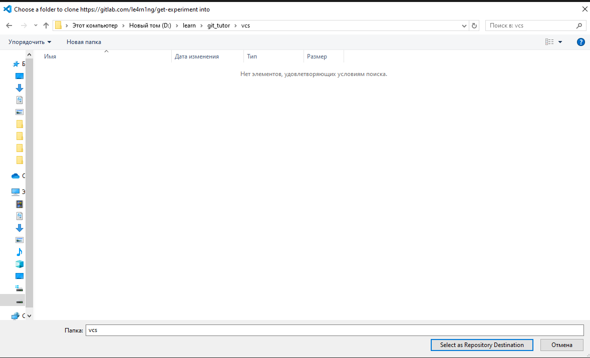

Нажать "Open" и проект откроется в этом окне, в случае "Open in New Window", откроется в новой

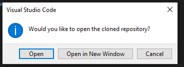

Если известен источник, то можно выбрать Yes, I trust the authors
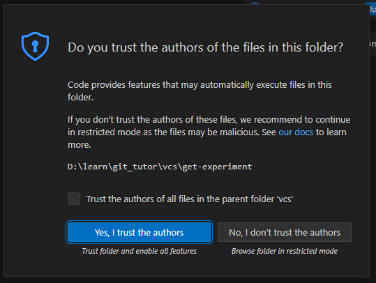

### Показать текущий статус
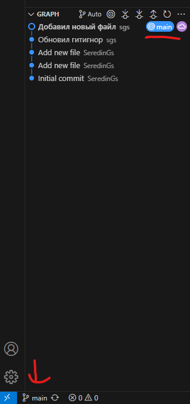

### Клонирование репозитория с передачей логопасса
TBD
### Обновить состояние репозитория
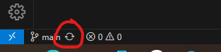

Появится оповещение о том, что сейчас произойдет синхронизация всех файлов в имеющейся папке

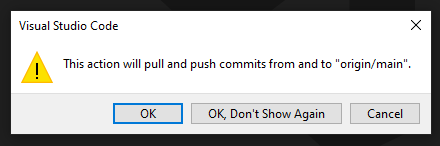

### Показать список доступных веток
Нажать на имя ветки

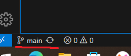

Появится список всех веток

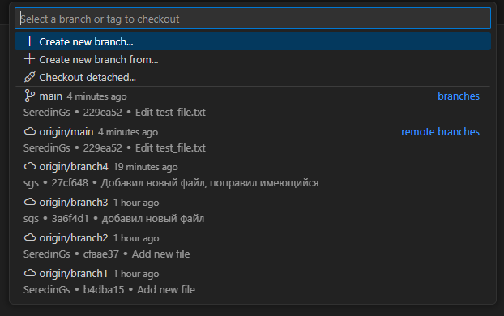

### Создать ветку от текущей и переключиться на неё
Нажать на имя ветки

Выбрать Create new branch

Ввести имя ветки и нажать Enter

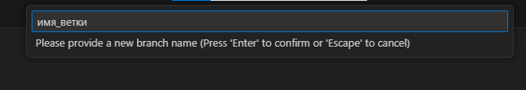

После создания VSC сам переключится на созданную ветку

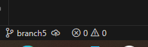

### Отслеживать новый файл
В момент создания файла VSC подсвечивает данный файл как Untracked

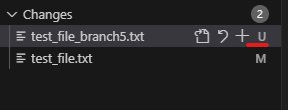

Такие файлы можно будет сохранить в момент сохранения изменений

### Сохранить изменения в ветке
Необходимо при помощи значка "+" добавить те файлы, которые необходимо сохранить, описать текст изменения коммита, затем нажать на кнопку Commit

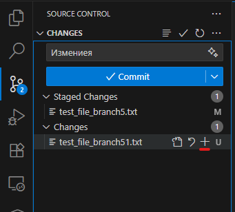

Если необходимо загрузить все файлы, то можно описать текст изменения и нажать на кнопку Commit. Тогда появится оповещение о неотмеченных файлах. В оповещении нажать ОК 

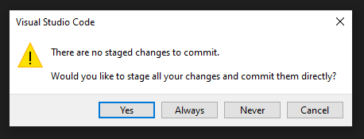

### Запушить изменения в удаленный репо
Необходимо при помощи значка "+" добавить те файлы, которые необходимо сохранить, описать текст изменения коммита, затем нажать на стрелку около кнопки Commit и выбрать Commit & Push

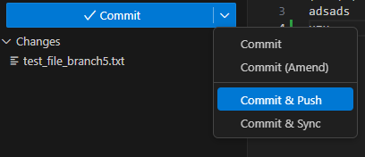

Если уже имеются закоммиченные изменения, то кнопка Commit изменит свою надпись на Sync Changes, либо Publish Branch в случае создания новой ветки. Для отправки изменений нужно нажать на эту кнопку, появится оповещение о последующей загрузке коммита. В оповещении нажать ОК

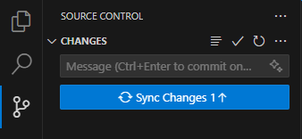

### Переключиться на имеющуюся ветку
Нажать на имя ветки

И выбрать нужную ветку

